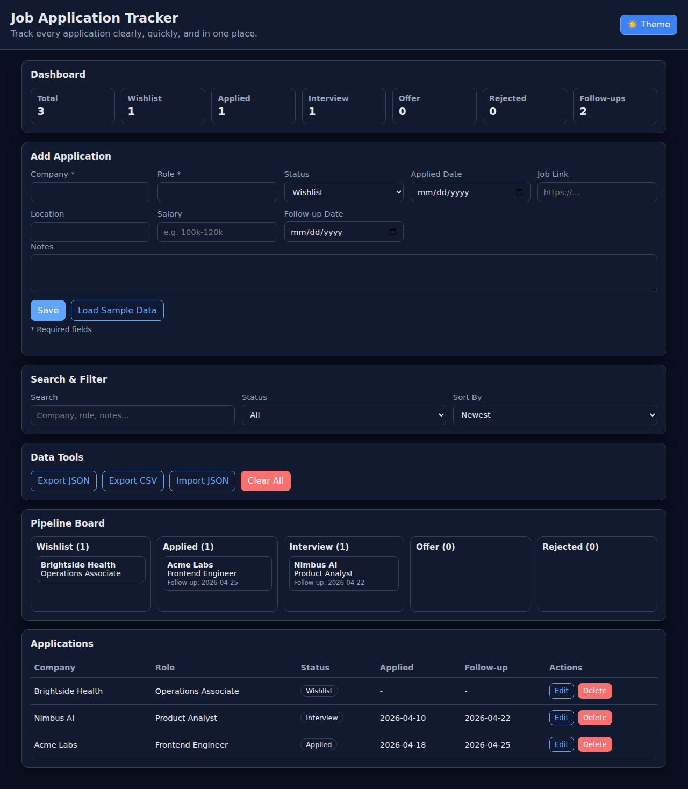
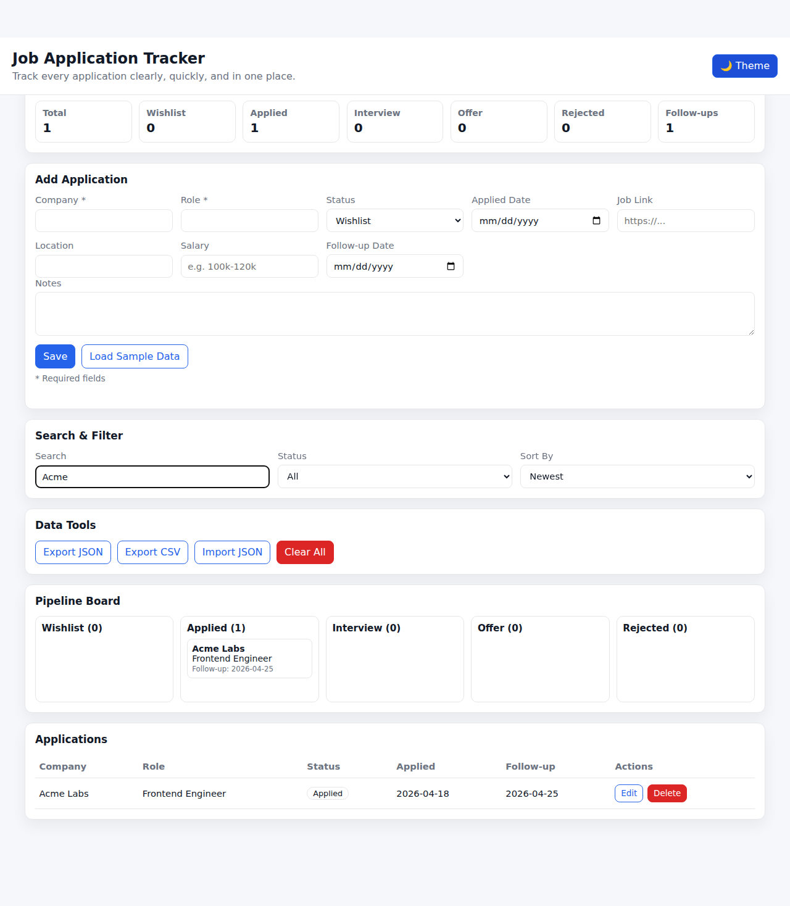
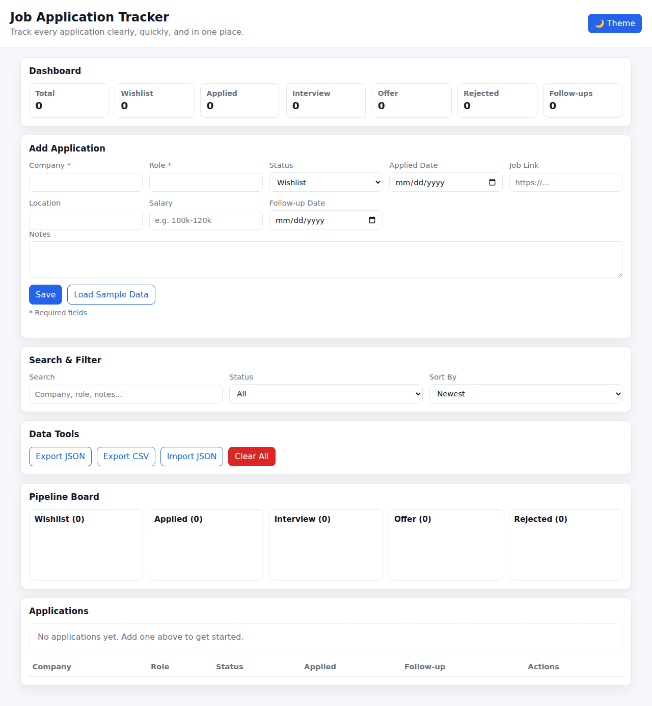
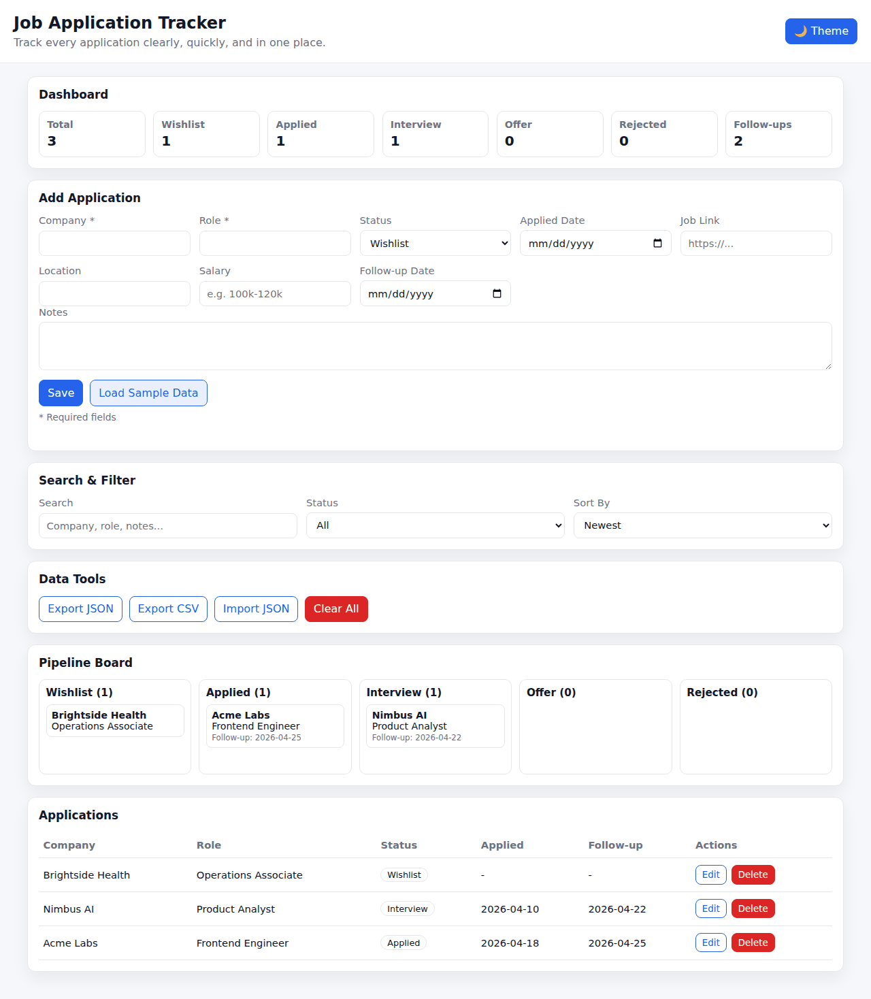

# Job Application Tracker

A production-ready, browser-first job application tracking web app that runs fully client-side and deploys via GitHub Pages.

## Why this is production-ready

### Gaps addressed vs. typical trackers

- ✅ **No backend required**: zero-server static app, easy to host and maintain.
- ✅ **Data portability**: JSON import/export and CSV export.
- ✅ **Fast workflow**: single-page CRUD + search/filter/sort + status board.
- ✅ **Security hardening**: unsafe HTML rendering removed from user-provided content paths.
- ✅ **Resilience**: imported data normalization and validation.
- ✅ **Deployment automation**: GitHub Pages workflow included.

## Core Features

- Dashboard with application and pipeline metrics
- Application lifecycle tracking (`Wishlist`, `Applied`, `Interview`, `Offer`, `Rejected`)
- Create, edit, delete applications
- Search, filter, and sort
- Follow-up tracking
- localStorage persistence
- JSON import/export and CSV export
- Light/dark mode
- Responsive UI (mobile + desktop)

## Screenshots

### Empty state


### With sample data


### Dark mode


### Search and filter in action


## Short Demo Videos (GIF)

### Product overview


### Search workflow


## Run the web app

### Start locally (recommended)

```bash
cd Job-Application-Tracker
python -m http.server 8000
```

Open: `http://localhost:8000`

### Direct open

Open `index.html` directly in your browser.

## Deployment (GitHub Pages)

This repo includes `.github/workflows/deploy-pages.yml`.

### One-time setup

1. In GitHub: **Settings → Pages**
2. Set **Source** to **GitHub Actions**
3. Ensure your default branch is `main` or `master`

### Deploy

1. Push this code to `main` (or `master`)
2. GitHub Actions runs **Deploy static site to GitHub Pages**
3. Site URL format:
   - `https://<your-username>.github.io/Job-Application-Tracker/`

## Is it deployed now?

- If the `Deploy static site to GitHub Pages` workflow is not visible/running in Actions yet, deployment is **not live yet**.
- You can still **start and use the app locally right now** via `python -m http.server 8000`.
- Once merged to default branch and Pages source is set to GitHub Actions, deployment becomes live automatically.

## Data & Privacy

- All data stays in your browser (`localStorage`) unless you export it.
- No external API calls are required for normal operation.
- Importing JSON replaces current in-browser data.

## File structure

- `index.html` — app markup
- `styles.css` — styling and responsive layout
- `app.js` — app logic and persistence
- `.github/workflows/deploy-pages.yml` — Pages deployment workflow
- `docs/assets/` — screenshots and demo GIFs
